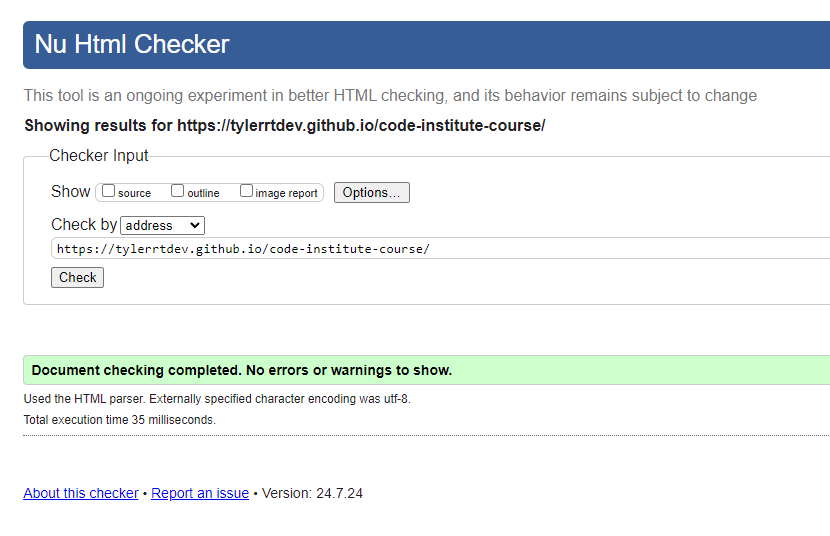
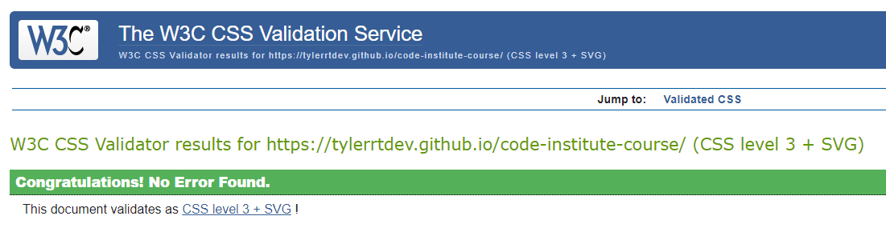

# Pump Fitness Gym Website

Link To Website: https://tylerrtdev.github.io/code-institute-course/

## Overview

The Pump Fitness Gym website is designed to create a thriving online presence for Pump Fitness Gym, offering information about gym memberships, classes, and services as well as business location. It provides an intuitive and user-friendly interface for current and potential members to explore membership options, contact the gym, and learn more about the facilities and community.

## Purpose

The primary purpose of this website is to:

- Inform visitors about the various services and membership options available at Pump Fitness Gym.
- Facilitate online membership registration and inquiries.
- Enhance the gym's visibility and engagement through social media links.
- Provide easy access to contact information and location details.

## Value to Users

The website offers significant value to users by:

- Providing comprehensive information about gym services and membership plans.
- Allowing users to conveniently register for memberships online.
- Enabling users to easily contact the gym and find its location.
- Connecting users with the gym's social media profiles for updates and community engagement.

## Deployment Procedure

To deploy the Pump Fitness Gym website, follow these steps:

### Clone the Repository:

```bash
git clone https://github.com/TylerRTDev/code-institute-course.git 

cd code-institute-course
```
## Set Up the Environment:

Ensure you have a web server environment such as Apache or Nginx. For local testing, you can use a simple server with Python:

```bash
python3 -m http.server 8000
```

## Deploy to a Web Server:
1. Upload the contents of the pump-fitness-gym directory to your web server's root directory.
2. Ensure the server is configured to serve HTML and CSS files correctly.

## Configure Domain:
1. Point your domain to your web server's IP address.
2. Ensure DNS settings are updated to reflect the changes.

## Test the Deployment:

Open your web browser and navigate to your domain to verify that the website is working as expected.

# User Stories

## Visitor

- As a visitor, I want to learn about the different membership options available so that I can choose the  best plan for my needs.
- As a visitor, I want to contact the gym easily, so I can inquire about services or memberships.
- As a visitor, I want to know the gym's location, so I can visit it in person.
## Member
- As a member, I want to access my membership information online, so I can manage my subscription.
- As a member, I want to stay updated with the gym's events and classes, so I can participate actively.

# Testing

### Manual Testing

#### Navigation
- Verify that all links in the navigation menu work correctly.
- Ensure the side menu opens and closes as expected on both desktop and mobile devices.

#### Forms
- Test the forms for validation.
  - Check for required field indications.
  - Ensure correct error messages are displayed for invalid inputs.
  - Verify successful form submission and expected outcomes.

#### Responsiveness
- Verify that the website layout adapts appropriately to various screen sizes (desktop, tablet, mobile).
- Ensure all elements are visible and usable on smaller screens.

#### Functionality
- Test all interactive elements (buttons, links, forms) to ensure they work as intended.
- Verify that any dynamic content (such as AJAX-loaded elements) updates correctly and promptly.
- Check that user actions produce the expected results (e.g., clicking a button leads to the correct page or action).

#### Usability
- Evaluate the ease of navigation and use of the website for a new user.
- Assess whether the information is easily accessible and the layout is intuitive.
- Ensure that the visual design is consistent and aesthetically pleasing.

### Automated Testing
Consider using automated testing tools like Selenium for end-to-end testing:

1. Write test scripts to automate the form submissions.
2. Use assertions to validate expected outcomes (e.g., success messages, form field validations).

### Design and Implement Manual Testing Procedures

#### Functionality Testing
- Design specific test cases for each feature of the website.
- Implement step-by-step procedures to test these features manually.
- Document the expected vs. actual results for each test case.

#### Usability Testing
- Create scenarios that a typical user might follow while using the website.
- Perform these scenarios to identify any usability issues.
- Gather feedback from real users and incorporate it into the usability testing process.

#### Responsiveness Testing
- Use various devices (desktop, tablet, mobile) to test the website.
- Implement a checklist for elements to verify on each screen size, such as visibility, alignment, and accessibility.

### Documentation
- Maintain a detailed log of all testing activities, including dates, testers involved, and results.
- Record any bugs or issues found, along with steps to reproduce and potential fixes.


## External References

- Google Fonts
    * https://fonts.google.com/icons
- Code Institute Form Dump
- https://www.w3schools.com/css/
    * https://www.w3schools.com/css/css3_transitions.asp
    * https://www.w3schools.com/cssref/tryit.php?filename=trycss_anim_background-size
    * https://www.w3schools.com/cssref/tryit.php?filename=trycss3_background-size
    * https://www.w3schools.com/cssref/css3_pr_background-size.php
    * https://www.w3schools.com/css/default.asp#gsc.tab=0
    * https://www.w3schools.com/css/css_form.asp
    * https://www.w3schools.com/css/css_navbar.asp
    * https://www.w3schools.com/css/css_website_layout.asp
    * https://www.w3schools.com/css/css_templates.asp
    * https://www.w3schools.com/cssref/pr_class_position.php
    * https://www.w3schools.com/css/tryit.asp?filename=trycss_buttons_animate1
    * https://www.w3schools.com/css/css3_buttons.asp
    * https://www.w3schools.com/howto/tryit.asp?filename=tryhow_js_collapse_sidebar
    * https://www.w3schools.com/cssref/pr_text_letter-spacing.php
- Course videos and personal notes
- https://stackoverflow.com/questions/15918251/how-to-move-div-vertically-down-using-css
- Google Maps Embed API: Google Maps Embed API - Used for embedding the location map.
- https://sites.google.com/view/how-to-with-new-sites/embeds/embed-with-iframes
- GYM Websites for inspiration.
    * https://www.hussle.com/
    * https://gorillabrazilianjiujitsu.com/
    * https://www.gymonlondon.com/
    * https://www.fitnessfirst.co.uk/
    * https://www.gymonlondon.com/
    * https://www.virginactive.co.uk/clubs/aldersgate/memberships/
    * https://www.gymbox.com/
    * https://www.thegymgroup.com/
- https://stackoverflow.com/questions/41468951/images-not-displaying-in-github-pages
- https://www.c-sharpcorner.com/article/creating-a-simple-login-page-using-html-and-css/
- https://www.shecodes.io/athena/36133-how-to-make-an-icon-smaller-in-css
- https://forum.freecodecamp.org/t/how-to-keep-footer-at-bottom-of-the-page/651022
- YouTube Videos: Videos that contained steps to build features I wanted to 
    * https://www.youtube.com/watch?v=8MgpE2DTTKA&ab
    * https://codepen.io/bradtraversy/pen/eYdMqvx?editors=1100
    * https://www.youtube.com/watch?v=JywjlMIVzH8&
    * https://www.youtube.com/watch?v=znqUwx0b0HI&ab
- https://www.geeksforgeeks.org/how-to-put-an-input-element-on-the-same-line-as-its-label/
- https://www.pexels.com/
- https://elements.envato.com/
- https://www.flaticon.com/
- https://developer.mozilla.org/en-US/docs/Web/CSS/container

### W3C Code Validation

<details>
<summary>HTML</summary>


</details>
<br>
<details>
<summary>CSS</summary>


</details>